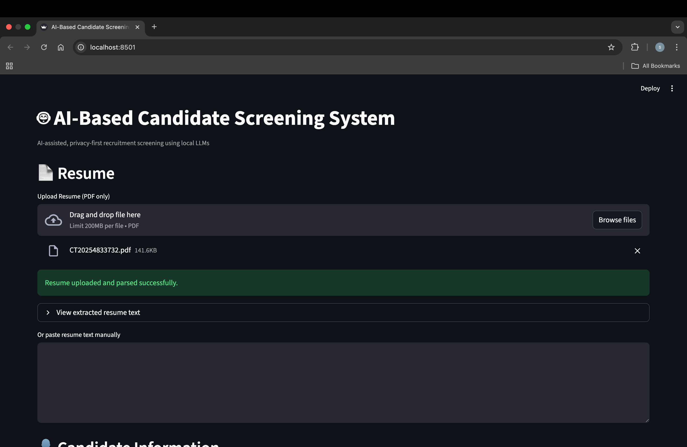
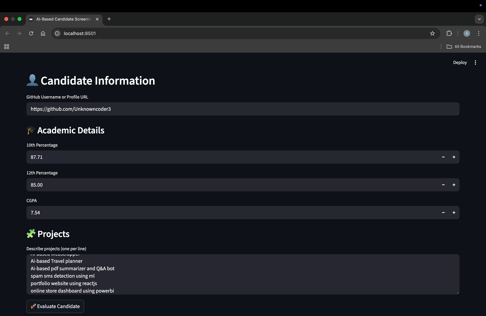
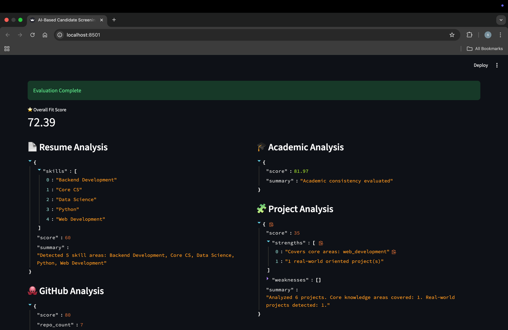
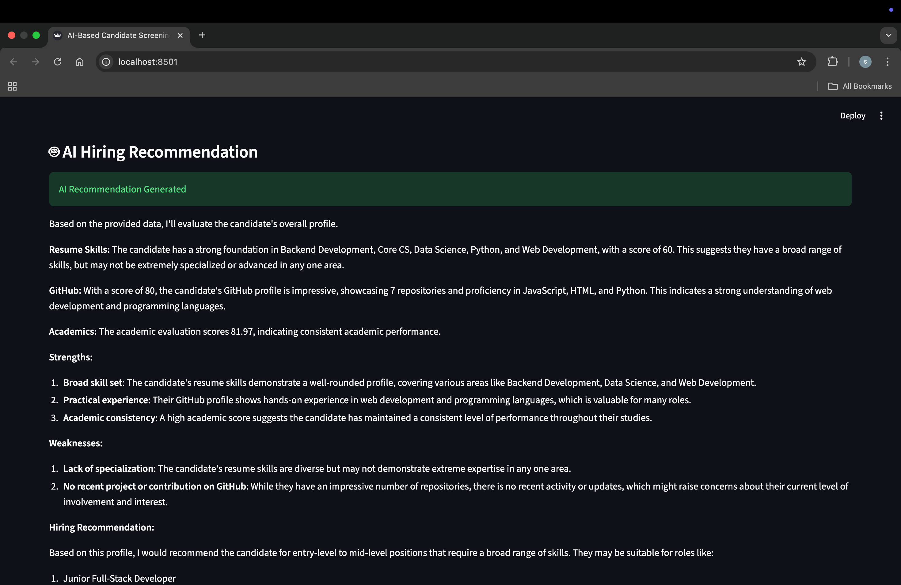
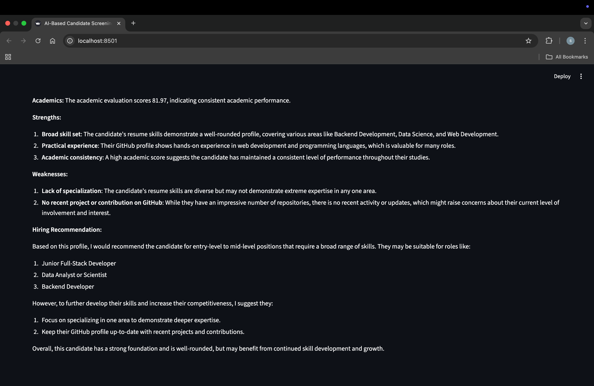

# 🤖 AI-Based Candidate Screening System

An **AI-powered, privacy-first recruitment screening tool** that helps recruiters evaluate candidates using **resume analysis, GitHub profile analysis, academic performance, and project experience**, with **local LLM-based hiring recommendations**.

> 🚀 Built with **Streamlit + Python + Ollama (Local LLM)** — no paid APIs required.

---

## ✨ Key Features

* 📄 **Resume Analysis**

  * Handles noisy PDF text (real ATS-style parsing)
  * Extracts technical skills using robust normalization

* 🐙 **GitHub Profile Analysis**

  * Works with **username or full GitHub URL**
  * API + graceful fallback handling (no API key required)
  * Repository count, languages, and quality-based scoring

* 🎓 **Academic Evaluation**

  * Considers 10th, 12th percentages & CGPA

* 🧩 **Project Analysis**

  * Detects real-world vs academic projects
  * Evaluates core CS & domain coverage

* 🤖 **AI Hiring Recommendation**

  * Uses **local LLM (Ollama)**
  * Non-blocking, timeout-safe inference

* 🔒 **Privacy First**

  * No external AI APIs
  * Runs completely on local machine

---

## 📸 Application Screenshots

> A quick visual walkthrough of the system

### 🏠 Main Dashboard



### 📄 Resume Analysis & Skill Extraction



### 🐙 GitHub Profile Analysis



### 🎓 Academic & 🧩 Project Evaluation



### 🤖 AI Hiring Recommendation (LLM Output)



---

## 🛠️ Tech Stack

* **Frontend / UI:** Streamlit
* **Backend:** Python
* **AI / LLM:** Ollama (LLaMA3 or compatible)
* **Parsing:** PDFMiner / regex-based NLP
* **APIs:** GitHub Public API (unauthenticated)

---

## 📂 Project Structure

```
ai-recruitment-screening/
│
├── app.py
│
├── analyzers/
│   ├── resume_analyzer.py
│   ├── github_analyzer.py
│   ├── academic_analyzer.py
│   └── project_analyzer.py
│
├── llm/
│   ├── ollama_client.py
│   └── prompts.py
│
├── scoring/
│   └── score_engine.py
│
├── utils/
│   ├── pdf_parser.py
│   └── github_api.py
│
├── requirements.txt
└── README.md
```

---

## ⚙️ Installation & Setup

### 1️⃣ Clone the Repository

```bash
git clone https://github.com/<your-username>/ai-recruitment-screening.git
cd ai-recruitment-screening
```

---

### 2️⃣ Create Virtual Environment (Recommended)

```bash
python -m venv venv
source venv/bin/activate   # macOS/Linux
venv\Scripts\activate      # Windows
```

---

### 3️⃣ Install Dependencies

```bash
pip install -r requirements.txt
```

---

### 4️⃣ Install & Run Ollama (Local LLM)

Download Ollama from: [https://ollama.com](https://ollama.com)

Then pull a model:

```bash
ollama pull llama3
```

Run Ollama:

```bash
ollama run llama3
```

> ⚠️ Keep Ollama running in a separate terminal

---

### 5️⃣ Run the Application

```bash
streamlit run app.py
```

Open in browser:

```
http://localhost:8501
```

---

## 🧪 How to Use

1. Upload **resume PDF** or paste resume text
2. Enter **GitHub username or profile URL**
3. Fill academic details
4. Add project descriptions (one per line)
5. Click **Evaluate Candidate**
6. View detailed analysis & AI recommendation

---

## 📊 Scoring Logic (High-Level)

| Component      | Weight |
| -------------- | ------ |
| Resume Skills  | 35%    |
| GitHub Profile | 25%    |
| Academics      | 25%    |
| Projects       | 15%    |

> Scores are explainable and conservative (ATS-style)

---

## 🧠 Why This Project Is Real-World Relevant

* Handles **messy PDF resumes**
* Works **without paid APIs**
* Uses **local LLMs for privacy**
* Implements **rate-limit handling & caching**
* Designed with **recruiter UX** in mind

---

## 🚀 Future Enhancements

* LLM-based resume skill extraction
* GitHub README quality analysis
* Commit activity scoring
* Bias masking (name/email removal)
* PDF export of evaluation report

---

## 👤 Author

**Snehasish Das**
Final Year CSBS Student | AI & Full-Stack Developer

* GitHub: [https://github.com/Unknowncoder3](https://github.com/Unknowncoder3)
* LinkedIn: [https://www.linkedin.com/in/snehasish-das-7a9803219](https://www.linkedin.com/in/snehasish-das-7a9803219)

---

## ⭐ If you like this project

Give it a **star ⭐** — it helps a lot!
# ai-recruitment-screening
